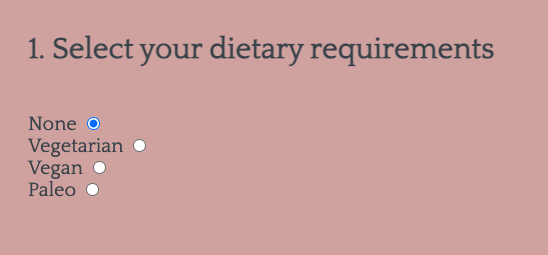
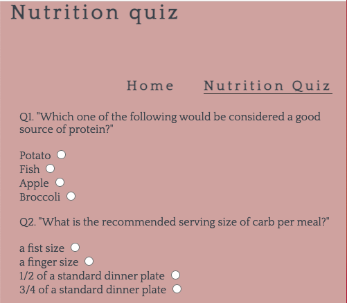

# Balanced Meal Generator

## Introduction

Balanced meal generator is a website for anyone who is interested in nutrition and looking for some inspiration on what food to prepare.

Users of this website will be able to select their dietary preferences and then generate a range of meal ideas, choosing from a randomised selection of food, while sticking to a nutritionally balanced plate break-down of 50% vegetables, 25% protein and 25% carbohydrate.

## User Experience (UX)

### Project Goals

* To create a minimalist, well-designed website that allows users to generate meal ideas, and complete a nutrition quiz to test the depth of their nutritional knowledge.

### User Goals

* To get ideas for what to cook and eat.
* To learn more about nutrition and healthy portion sizes.

### Site Owner's Goals

* To create a useful and easy-to-use meal generator tool.
* To get new webiste visitors.

### Target Audience

* Anyone looking to improve their nutritional knowledge.
* Anyone lacking inspiration on what to cook.

### Structure:

The site has 2 pages: 

Home page - The 'Home' page contains an eye-catching plate image, which is divided into 3 sections - 50% of vegetable content, 25% of protein content and 25% of carbohydrate content. 
There user is first invited to select their dietary preference by clicking on the desired radio button. 
There is then a clear 'Inspire me!' call to action button which generates a new meal idea everytime the user clicks it, sticking to the recommended food group percentages.

Underneath this is a brief explanation of the balanced meal generator and its purpose. 

Nutrition quiz -  The 'Nutrition quiz' page gives the user a chance to put their nutritional knowledge to the test, providing some light entertainment which relates to the main feature of the site - the generator.

For consistency of user experience, the site logo, navigation links and footer remain consitent throughout the site.

### Wireframes:

Mock-ups were made using Balsamiq to help plan and visualise the site design. They were created for 3 main screen sizes: mobile, tablet and desktop.

- [Wireframes](docs/MS2-home-desktop.pdf): 'Home' page desktop.
- [Wireframes](docs/MS2-quiz-desktop.pdf): 'Nutrition Quiz' page desktop.
- [Wireframes](docs/MS2-home-mobile.pdf): 'Home' page mobile.
- [Wireframes](docs/MS2-quiz-mobile.pdf): 'Nutrition Quiz' mobile.

### Design:

* Colour Scheme:

  The colour palette includes calm and complimenting colours. The palette was chosen using the [Coolors](https://coolors.co/) colour generator website.

  

  The colours mainly used were:

  Charcoal: #424B54

  English Lavender: #B38D97

  Pastel Pink: #D5ACA9

  Peach Puff: #EBCFB2

  Pale Silver: #C5BAAF

  Some slightly different shades of similar colors were also used in different parts of the site to achieve the best possible contrast for user experience.

* Typography:

  'Quattrocento', taken from Google Fonts, is the main font used throughout the website with 'Sans Serif' as the fallback font. It is clear and neat.

* Imagery:

  All images were sourced from [Pexels](https://www.pexels.com/) and [Unsplash](https://unsplash.com/).

  The main feature of the home page is the meal generator plate which comprises of three sepoarate images for the different food groups. This is set to images which represent each food group when the user first arrives on the page, and these are then replaced with new images according to the plate section each time the user clicks to generate new meal inspiration. 

  ## Features

### Existing Features:

* Heading and Navigation

  * Horizontally aligned navigation bar with 2 navigation links exists on both pages.

  * Navigation bar is consistently displayed at the top of the page so users know what to expect and can navigate easily.

  * On mobile, the navigation menu links are displayed underneath the page heading, instead of in-line.

  * The heading is featured clearly at the top of the page.

Desktop:

  

Mobile:

  

* Dietary Requirements section

  * On the home page, the user is initially directed to the first step of generating their meal - selecting their dietary requirements. The diet options are provided as a list of radio buttons. Depending on what diet the user selects, the meal generator plate will only return results that are appropriate for that diet. 

  Desktop:

  

  Mobile: 

  

* Meal generator

  * Once the user has selected their diet of choice, they are invited to click the 'inspire me!' button which will generate a meal idea in line with their diet, and displayed as 50% of the plate for the vegetable portion, and 25% each for the protein and carbohydrate portions. Each time the user clicks the button, a new meal idea will be returned by randomly selecting a dish from the website's selection for each category.

  Desktop - 'Inspire me!' button:

  

  Desktop - Home page meal plate image:

  

  Desktop - Home page generated meal plate image:

  

  Mobile - Home page generated meal plate image:

  

* Nutrition Quiz

  * The second page of the site has a nutrition quiz which is offered as some light entertainment for the user, and to share some interesting nutrition facts which the user may not have been aware of. This is a multiple choice quiz in which the user is given four answer options per question. At the end of the quiz they click the submit button which calculates and returns their quiz score.
  * Depending on the user's quiz score, a percentage result and accompanying message is generated. For the lower-end scores (0 - 29%), the message suggests that the user may benefit from using the balance meal generator; for 30 - 59%, the user is given kudos for their respectable level of nutritional knowldege but may still benefit from the meal generator. For scores between 60 - 89%, the user receives a congratulations; and for scores from 90% and above, users are compared to a qualified nutritionist.
  * Beside the 'submit' button is a refresh button which clears all of the checked radio buttons on the page as well as the result and message, if there is one displayed at that time.

  Desktop - Nutrition quiz:

  

  Desktop - nutrition quiz and result message, example 1:

  

  Desktop - nutrition quiz and result message, example 2:

  

  Desktop - refresh button:

  

  Mobile - Image of nutrition quiz

  

  Mobile - nutrition quiz and result message, example 2:

  
  

### Features To be Implemented in Future:

* Add calorie addition to the function
* Create feauter for users to add their own dishes/food types.
* Add more diet types, e.g. coeliac.
* Add more options for all food types for better user experience.

