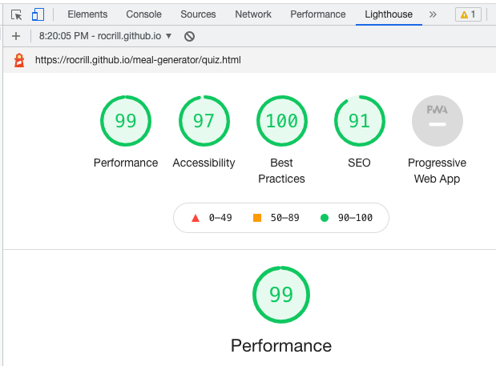

# Balanced Meal Generator

## Introduction

Balanced meal generator is a website for anyone who is nutrition-conscious and lacking inspiration on what food to prepare.

Users of this website will be able to select their dietary preferences and then generate a range of meal ideas, choosing from a randomised selection of food, while sticking to a nutritionally balanced plate break-down of 50% vegetables, 25% protein and 25% carbohydrate.

The website also contains a nutrition quiz to provide some light entertainment for the user, whilst promoting nutritional awareness. Depending on the quiz results, the user may also be advised to give the meal generator a go to improve their nutritional health.

## User Experience (UX)

### Project Goals

* To create a minimalist, well-designed website that allows users to generate meal ideas, and complete a nutrition quiz to test the depth of their nutritional knowledge.

### User Goals

* To get ideas for what to cook and eat.
* To learn more about nutrition and healthy portion sizes.

### Site Owner's Goals

* To create a useful and easy-to-use meal generator tool.
* To get new webiste visitors.

### Target Audience

* Anyone looking to improve their nutritional knowledge.
* Anyone lacking inspiration on what to cook.

### Structure:

The site has 2 pages: 

Home page - The 'Home' page contains an eye-catching plate image, which is divided into 3 sections - 50% of vegetable content, 25% of protein content and 25% of carbohydrate content. 
The user is first invited to select their dietary preference by clicking on the appropriate radio button. 
There is then a clear 'Inspire me!' call to action button which generates a new meal idea everytime the user clicks it, sticking to the recommended food group percentages. 

Nutrition quiz -  The 'Nutrition quiz' page gives the user a chance to put their nutritional knowledge to the test, providing some light entertainment which relates to the main feature of the site - the meal generator.

For consistency of user experience, the site heading, navigation links and footer remain consistent throughout the site.

### Wireframes:

Mock-ups were made using Balsamiq to help plan and visualise the site design. They were created for 2 main screen sizes: mobile and desktop.

- [Wireframes](docs/MS2-home-desktop.pdf): 'Home' page desktop.
- [Wireframes](docs/MS2-quiz-desktop.pdf): 'Nutrition Quiz' page desktop.
- [Wireframes](docs/MS2-home-mobile.pdf): 'Home' page mobile.
- [Wireframes](docs/MS2-quiz-mobile.pdf): 'Nutrition Quiz' mobile.

As the site was developed some additional features were added which were not included in the original wireframes, mainly the name input form at the beginning of the nutrition quiz and the image and results div that is displayed as the quiz results are returned. 

### Design:

* Colour Scheme:

  The colour palette includes calm and complimenting colours. The palette was chosen using the [Coolors](https://coolors.co/) colour generator website.

  

  The colours mainly used were:

  Charcoal: #424B54

  English Lavender: #B38D97

  Pastel Pink: #D5ACA9

  Peach Puff: #EBCFB2

  Pale Silver: #C5BAAF

  Some slightly different shades of similar colors were also used in different parts of the site to achieve the best possible contrast for user experience.

* Typography:

  'Quattrocento', taken from Google Fonts, is the main font used throughout the website with 'Sans Serif' as the fallback font. It is clear and neat.

* Imagery:

  All images were sourced from [Pexels](https://www.pexels.com/), [Unsplash](https://unsplash.com/) and [Pixabay](https://pixabay.com/).

  The main feature of the home page is the meal generator plate which comprises of three separate images for the different food groups. This is set to images which represent each food group when the user first arrives on the page, and these are then replaced with new images according to the plate section each time the user clicks to generate new meal inspiration. 

## Features

### Existing Features:

* Heading and Navigation

  * Horizontally aligned navigation bar with 2 navigation links exists on both pages.

  * Navigation bar is consistently displayed at the top of the page so users know what to expect and can navigate easily.

  * On mobile, the navigation menu links are displayed underneath the page heading, instead of in-line.

  * The heading is featured clearly at the top of the page.

  Desktop:

  

  Mobile:

  

* Dietary Requirements section

  * On the home page, the user is initially directed to the first step of generating their meal - selecting their dietary requirements. The diet options are provided as a list of radio buttons. Depending on what diet the user selects, the meal generator plate will only return results that meet the criteria for that diet. 

  Desktop:

  

  Mobile: 

  

* Meal generator

  * Once the user has selected their diet of choice, they are invited to click the 'inspire me!' button which will generate a meal idea in line with that diet, and which will be displayed as 50% vegetables, 25% protein and 25% carbohydrate. Each time the user clicks the button, a new meal idea will be returned by randomly selecting a dish from the website's selection for each category.

  Desktop - 'Inspire me!' button:

  

  Desktop - Home page meal plate image:

  

  Desktop - Home page generated meal plate image:

  

  Mobile - Home page generated meal plate image:

  

* Nutrition Quiz

  * The second page of the site has a nutrition quiz which is offered as some light entertainment for the user, and to share some interesting nutrition facts which the user may not have been aware of. This is a multiple choice quiz in which the user is given four answer options per question. At the end of the quiz they click the 'submit' button which calculates and returns their quiz score.
  * Depending on the user's quiz score, a percentage result and accompanying message and image are generated. For the lower-end scores (0 - 29%), the message suggests that the user may benefit from using the balance meal generator; for 30 - 59%, the user is given kudos for their respectable level of nutritional knowldege but may still benefit from the meal generator. For scores between 60 - 89%, the user receives a congratulations; and for scores from 90% and above, users are compared to a qualified nutritionist.
  * Beside the 'submit' button is a 'refresh' button which clears all of the checked radio buttons on the page as well as the result and message, if there is one displayed at that time.

  Desktop - Nutrition quiz:

  

  Desktop - nutrition quiz and result message, example 1:

  

  Desktop - nutrition quiz and result message, example 2:

  

  Desktop - refresh button:

  

  Mobile - Image of nutrition quiz

  

  Mobile - nutrition quiz and result message, example 2:

  

### Features To be Implemented in Future:

* Add approximate calorie addition to the 'generateMeal' function.
* Create feature for users to add their own dishes/food types.
* Add more diet types, e.g. coeliac.
* Add more options for all food categories for better user experience and increased usability.

## Technologies Used

### Languages:

*  [HTML 5](https://en.wikipedia.org/wiki/HTML5)
*  [CSS 3](https://en.wikipedia.org/wiki/CSS)
*  [JavaScript](https://en.wikipedia.org/wiki/JavaScript)

### Frameworks, libraries and programs used:

* [Balsamiq](https://balsamiq.com/) - to create wireframes for the site as part of the project preparation.
* [Google Fonts](https://fonts.google.com/) - to import the 'Quattrocento' and 'Sans Serif' fonts into the HTML file, which were then used throughout the site.
* [Font Awesome](https://fontawesome.com/) - for icons which were added to the footer social media links.
* [Coolors](https://coolors.co/) - for an appropriate and attractive colour palette.
* [Chrome DevTools](https://developer.chrome.com/docs/devtools/) - to inspect and debug the code through all stages of the development.
* [Lighthouse](https://developers.google.com/web/tools/lighthouse) - to check the site for performance, accessibility and best practices.
* [Am I Responsive](http://ami.responsivedesign.is/) - to produce a preview of the site on different devices.
* [W3C HTML Validator](https://validator.w3.org/#validate_by_input) - to validate HTML code.
* [W3C CSS Validator](https://jigsaw.w3.org/css-validator/) - to validate CSS code.
* [JShint](https://jshint.com/) - to validate JavaScript code.
* [GitHub](https://github.com/) - for hosting the project code and version control.
* [Gitpod](https://gitpod.io/account) - to write the code and push it to GitHub.
* [Github Pages](https://pages.github.com/) - to deploy the site.
* [Unsplash](https://unsplash.com/) - for images.
* [Pexels](https://www.pexels.com/) - for images.

# Deployment

## Deploying to GitHub Pages

The site was developed in GitPod and deployed to GitHub pages. The steps to deploy are as follows:

* Navigate to the Github repository. For this project, this is rocrill/meal-generator 
* Navigate to the Settings tab, then to Pages.
* From the Source secton drop-down menu, select the Master Branch ( or Branch: Master and Root folder). Save.
* Once the master branch has been selected, you will see the message: 'Your site is published' and a link to the deployed site will be provided.

The live link can be found here - https://rocrill.github.io/meal-generator/

## Forking to GitHub Repository

You can create a fork (copy) of the repository. This allows you to experiment with the code without affecting the original project.

To fork the repository:

1. Log in to your GitHub account.
2. On GitHub, navigate to the repository you want to fork.
3. In the top right corner of the page, underneath your profile avatar, click Fork.
4. You should now have a copy of the original repository in your GitHub account.

## Making a local clone:

You can clone your repository to create a local copy on your computer. Any changes made to the local copy will not affect the original project. To clone the Meal Generator project, follow the steps below:

1. Log in to your GitHub account and locate the Meal Generator repository.
2. In the repository, click on Code button located above all the project files.
3. Under HTTPS, copy the link generated - https://github.com/rocrill/meal-generator.git.
4. Open the terminal you are using, e.g. Gitpod.
5. Change the current working directory to the location where you want the cloned directory created.
6. Type git clone and then paste the URL you copied earlier: `git clone https://github.com/rocrill/meal-generator.git`.
8. Press Enter to create your local clone.

# Testing

I tested the site regularly during the development process, by previewing it in the live server window and inspecting with Google Chrome DevTools at various stages.

When I was editing for responsiveness I tested the site on all devices available to me:
-Huawei Y6 2019
-Iphone 6S
-Macbook Pro

In general I believe that the site looks better on desktop, however the mobile media query used results in a good adaptation of the site to these smaller devices.

I also tested the site on the following browsers. There were no display issues on any of these:
-Firefox
-Google Chrome
-Microsoft Edge
-Safari

At the final stages of the project the W3C Markup Validator and W3C CSS Validator and JShint Services were used to validate every page of the project to ensure there were no syntax errors.

## Validator Testing 

* HTML Validator Errors & Warnings:

  * Warning: Section lacks heading. Consider using h2-h6 elements to add identifying headings to all sections.

    Fixed: Changed a `section` element to a `div` element as the heading was not required.

  * Error: Character reference was not terminated by a semicolon.

    Fixed: Added semicolon to `&nbsp;` HTML entities.

  * Error: The value of the `for` attribute of the `label` element must be the ID of a non-hidden form control.

    Fixed: Changed the label's `for` attribute to the same as the `id` name of what the label is for.

  * Error: No space between attributes.

    Fixed: Got rid of semicolon after `onclick` event function. 

  * Error: Element “head” is missing a required instance of child element “title”.

    Fixed: Put missing `title` in the `head` of the quiz.html file.

* CSS Validator Errors & Warnings: None.
  
- HTML: No errors were returned on the final passing of the site through the official [W3C validator](https://validator.w3.org/nu/?doc=https%3A%2F%2Frocrill.github.io%2Fmeal-generator%2F)
- CSS: No errors were found on the final passing of the site through the official [(Jigsaw) validator](https://jigsaw.w3.org/css-validator/validator?uri=https%3A%2F%2Frocrill.github.io%2Fmeal-generator%2F&profile=css3svg&usermedium=all&warning=1&vextwarning=&lang=en)

- JavaScript
    - No errors were found when passing through the official [Jshint validator](https://jshint.com/)
    - The following metrics were returned:
    - In quiz.js:
      - There are 2 functions in this file.
      - Function with the largest signature take 0 arguments, while the median is 0.
      - Largest function has 32 statements in it, while the median is 19.
      - The most complex function has a cyclomatic complexity value of 11 while the median is 6.5. 
    - In script.js:
      - There are 2 functions in this file.
      - Function with the largest signature take 2 arguments, while the median is 1.
      - Largest function has 26 statements in it, while the median is 14.5.
      - The most complex function has a cyclomatic complexity value of 12 while the median is 6.5.

## Lighthouse Testing

The Lighthouse report from Google Chrome DevTools showed very good results for Performance, Accessibility, SEO and best practices of the site. 

Home page - mobile 

Home page - desktop 

Nutrition quiz - mobile 

Nutrition quiz - desktop 

## Bugs

* Fixed:
  * Initially it was possible for the user to select multiple radio buttons per question in the nutrition quiz. This was addressed by adding the question input 'name' attributes, e.g. "q1", so that only one q1 radio button could be selected at once. 
  * Initially, after filling out the nutrition quiz answers and submitting them, it was not possible to clear the buttons without refreshing the site page. This was addressed by creating the 'refreshPage' function.
  * When the input name field was first added to the nutrition quiz, the result message would appear with extra spaces in cases where no name was input. To address this an 'if' statement was added to the fName variable to add a space to the beginning of user names where they are unput, to avoid extra spaces in cases where no names are input.
  * When the result image and message div was added to the nutrition quiz, this rectangular block remained on the page after initially appearing as part of a result message. To address this, the style of that div was updated with JavaScript within the 'refreshPage' function so that the display was equals to "none". To ensure that the div then re-appeared when results were given, the div style was updated so that the display equals "block" when results are being returned through the 'calculateScore' function. 
  * When the nutrition quiz results were first tested, these included non-integers. To address this, the math.round function was used, dividing the user score by the total number of questions, and multiplying the result by 100.
  
* Unfixed Bugs:

  * There are no unfixed bugs as such. There are some parts of the site where positioning could be improved, e.g. depending on the quiz result you receive and what device you are viewing on, the result is not entirely symmetrical. 

# Credits

## Code

The Code Institute LMS content, as well as some posts on Stackoverflow were used to create this site. All code taken from these resources has been adapted to suit the needs of this site, except for the specific cases referenced below.

* The following articles were used to achieve the quarter and semi-circle plate sections shape and positioning for the meal generator.

[Code Grepper](https://www.codegrepper.com/code-examples/css/make+a+quarter+of+circle+css)
[W3Schools](https://www.w3schools.com/css/css3_borders.asp) 
[Singhak](https://singhak.in/draw-half-and-quarter-circle-with-css/)
[Free Code Camp](https://www.freecodecamp.org/news/how-to-use-the-position-property-in-css-to-align-elements-d8f49c403a26/#:~:text=In%20position%3A%20relative%20%2C%20the%20element,corner)%20of%20its%20parent%20element.)

* This [Mozilla](https://developer.mozilla.org/en-US/docs/Web/JavaScript/Reference/Global_Objects/Math/random) article was used to get the math.random function used in the meal generator.

* This [W3Schools](https://www.w3schools.com/jsref/jsref_dowhile.asp) article was used for the 'do while' loop used as part of the generate meal function.

* This [Stack Overflow](https://stackoverflow.com/questions/2554116/how-to-clear-radio-button-in-javascript) article was used when creating the 'refresh' button function which clears all radio buttons and any existing result text.

* This [Free Code Camp](https://www.freecodecamp.org/news/how-to-keep-your-footer-where-it-belongs-59c6aa05c59c/) article was used when addressing a persistent footer positioning issue.

* This [Stack Overflow](https://stackoverflow.com/questions/9866220/why-are-two-vertical-scrollbars-showing) article resolved a double vertical scroll bar issue on mobile.

* Icons taken from [Font Awesome](https://fontawesome.com/).

## Images

Images were sourced from Unsplash, Pexels and Pixabay.

Spinach image by Ponce Photogrpahy on [Pixabay](https://pixabay.com/photos/spinach-healthy-green-dieting-1427360/)

Peppers image by Kareni on [Pixabay](https://pixabay.com/photos/fire-embers-blind-cob-barbecue-2697189/)

Mashed potatoes image by 422737 on [Pixabay](https://pixabay.com/photos/mashed-potatoes-potatoes-meal-food-439984/)

Roast chicken image by RitaE on [Pixabay](https://pixabay.com/photos/chicken-roast-chicken-4110208/)

Salmon image by cattalin on [Pixabay](https://pixabay.com/photos/salmon-fish-seafood-veggies-salad-518032/)

Steak image by Divily on [Pixabay](https://pixabay.com/photos/steak-flesh-schnitzel-chop-grill-2936531/)

Rice image by Kalyani Akella on [Unsplash](https://unsplash.com/photos/vCNLO20cuwY)

Penne image by Ben Lei on [Unsplash](https://unsplash.com/photos/flFd8L7_B3g)

Sourdough image by Vicky Ng on [Unsplash](https://unsplash.com/photos/JlwXPO7DStM)

Vegetable category image by Chantal Garnier on [Unsplash](https://unsplash.com/photos/910GanwBoew)

Carb category image by congerdesign on [Pixabay](https://pixabay.com/photos/noodles-rice-potatoes-food-pasta-516635/)

Protein category image by Sam Moqadam on [Unsplash](https://unsplash.com/photos/VpOpy6QrDrs)

Broccoli image by auntmasako on [Pixabay](https://pixabay.com/photos/broccoli-green-fresh-vivid-1630519/)

Chickpea image by Clark Douglas on [Unsplash](https://unsplash.com/photos/LvL8u99H0mY)

Halloumi image by Nastasya Day on [Pixabay](https://pixabay.com/photos/cheese-halloumi-fried-grill-milk-6466491/)

Omelette image by mhurton on [Pixabay](https://pixabay.com/photos/omelette-eggs-fork-spinach-food-1071021/)

Nutritionist image by Yaroslav Shuraev on [Pexels](https://www.pexels.com/photo/food-people-woman-coffee-8845668/)

Nutritionist image by Yilmaz Akin on [Unsplash](https://unsplash.com/photos/FPKtCl74Hfs)

# Acknowledgements

Thank you to:

* My mentor, Gerard McBride, for his help and guidance.
* The tutors at the Code Institute for their help and support.
